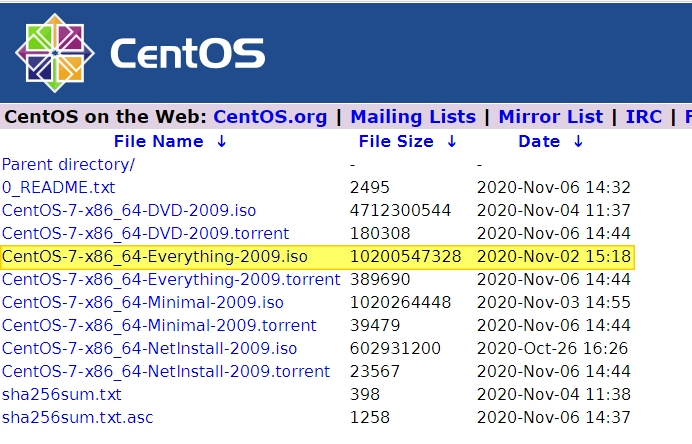
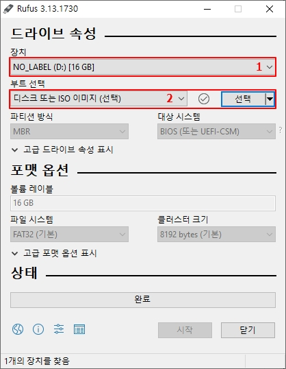
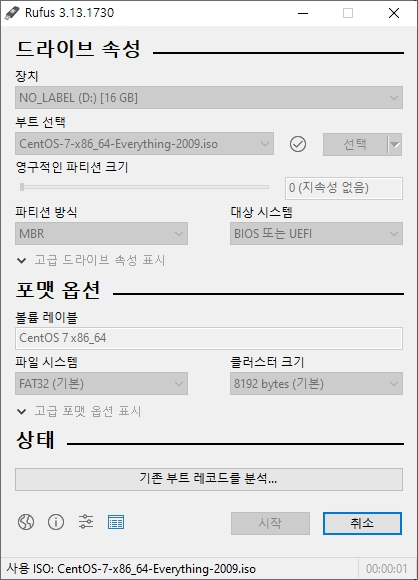

---  
sort: 1
title: CentOS 7 설치(1) 
last_modified_at: 2021-03-01 23:05
---  

# CentOS 7 설치 준비  
> [1. Download CentOS 7 iso](#1-download-centos-7-iso)  
> [2. 부팅 USB 만들기](#2-부팅-usb-만들기-using-rufus)

#### 준비물  
- CentOS 7을 설치할 장비  
- 8GB 이상 USB   

---

### 1. Download CentOS 7 iso  
아래 URL에서 원하는 저장소에서 iso 파일 다운로드  
<http://isoredirect.centos.org/centos/7/isos/x86_64/>  

__설치 파일 종류__  

- __DVD__  
    CentOs를 사용하기 위해 필요한 최소 패키지와 일반 패키지가 구성되어 있는 이미지(기본 개발패키지 및 GUI 패키지)  
	설치 후, 추가 패키지를 설치해야 하는 경우에는 인터넷 연결이 되어 있어야 함  
	인터넷 연결이 어려운 경우, Everything 이미지 파일을 사용  
- __Everything__  
    모든 패키지가 포함되어 있는 이미지  
	기본 설치 패키지 + 32bit 패키지 등의 여러 추가 패키지가 포함되어 있으며, 인터넷 연결이 어려운 경우 해당 파일을 사용하여 내부 저장소를 구축하여 추가 패키지를 yum으로 설치하면 됨  
- __Minimal__  
    CentOS를 사용하기 위한 필요한 최소 패키지만 포함된 이미지 (GUI 미포함)  
- __NetInstall__  
    네트워크 설치를 위한 최소의 CD 이미지  
  
어짜피 나중에 종류별로 다 한 번씩 설치할 것 같지만, 일단 Everything을 먼저 설치했다. (일반적으로는 Minimal을 설치하여 필요한 패키지를 추가하는 방식을 추천)

---

### 2. 부팅 USB 만들기 (using Rufus)  

> [Rufus Download 링크](https://rufus.ie/ "https://rufus.ie/")  

Rufus를 설치하여 아래와 같이 1. USB 선택, 2. iso 파일 옵션을 선택한다.  
파티션 방식, 대상 시스템, 파일 시스템 등은 원하는 옵션을 선택하고 __'시작'__ 버튼을 눌러 USB를 포맷해준다.  

  

이걸로 CentOS 7 설치를 위한 준비는 끝.