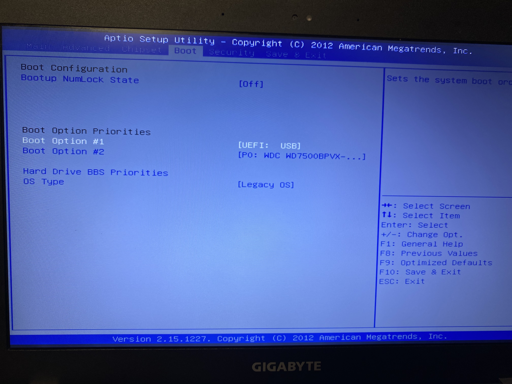
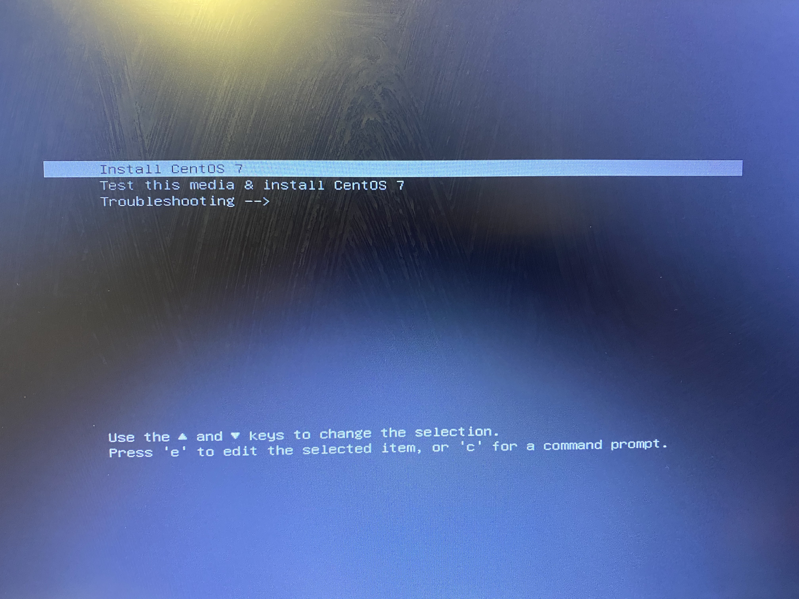
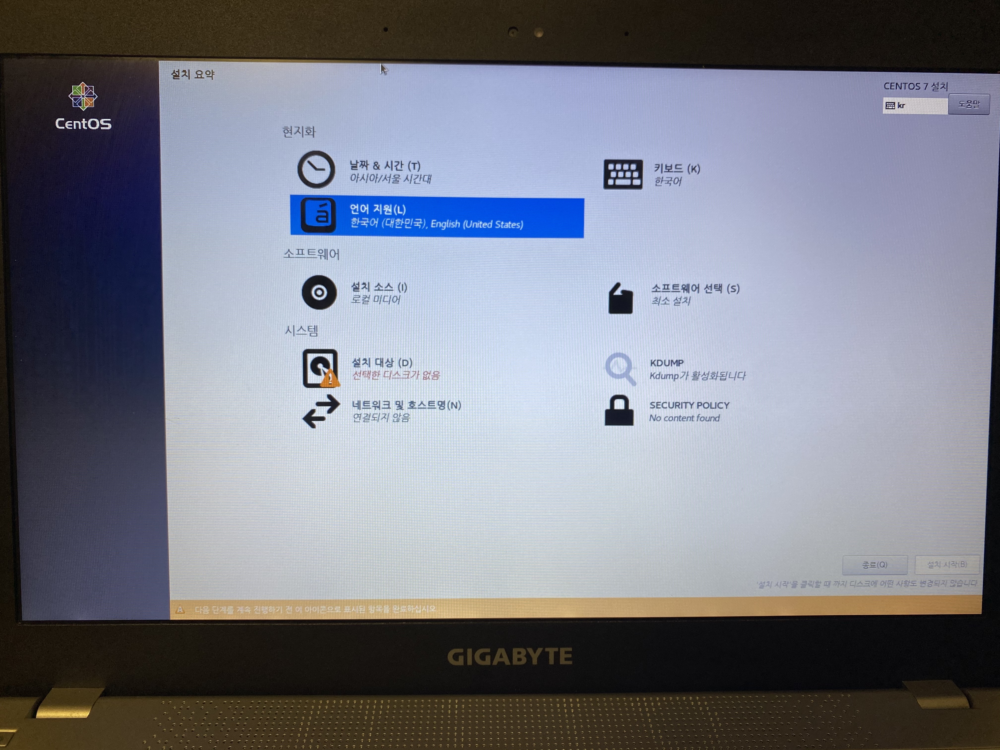
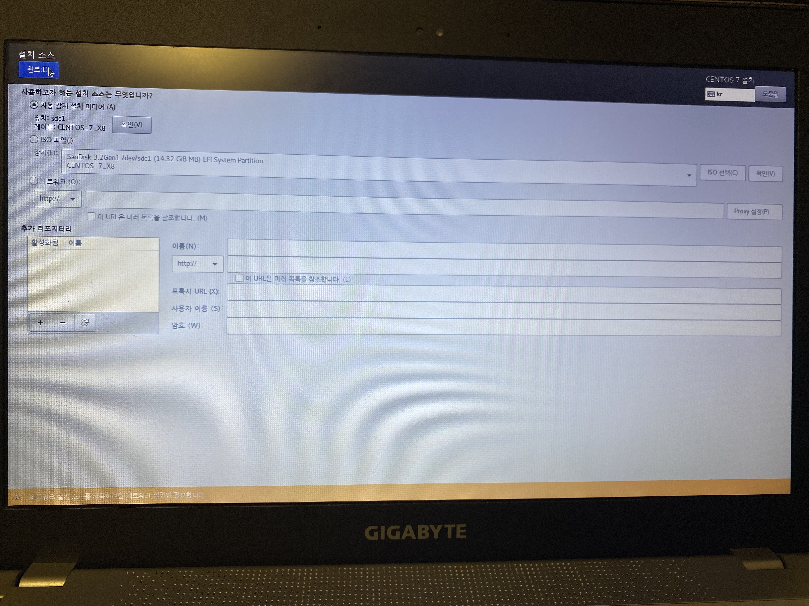
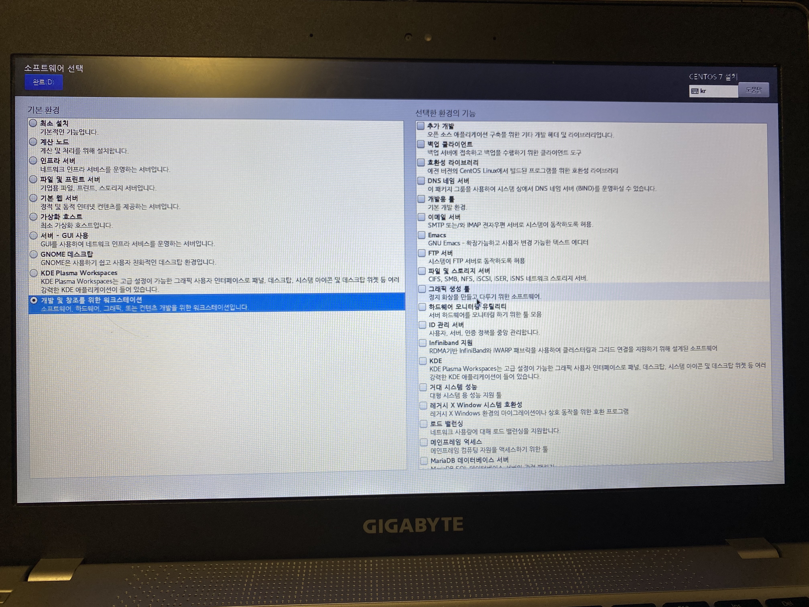
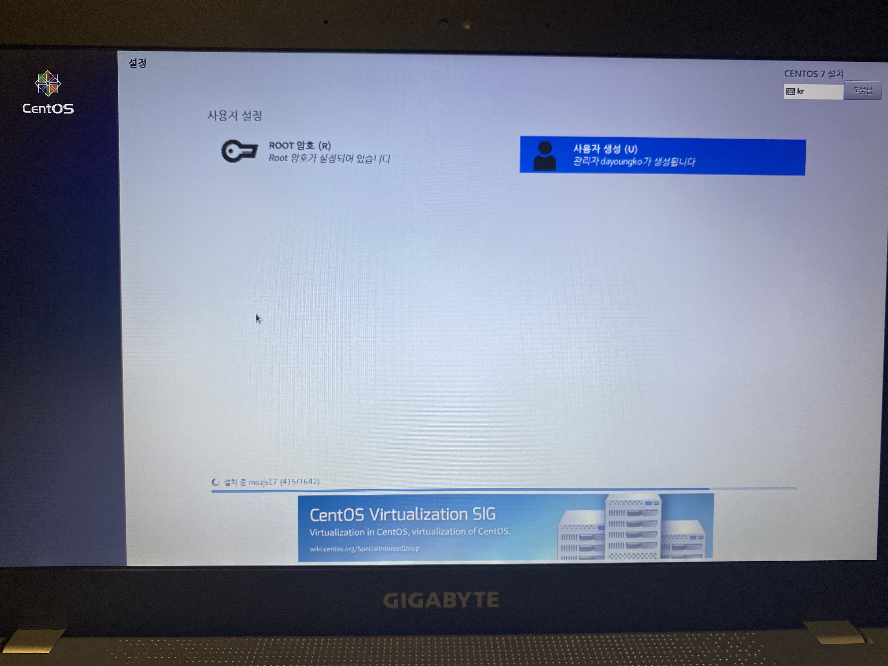

---  
sort: 2
title: CentOS 7 설치(2) 
last_modified_at: 2021-03-01 23:05
---  

# CentOS 7 설치  
> [1. Set Boot Option](#1-set-boot-option)  
> [2. Install CentOS 7](#2-install-centos-7)   

### 1. Set Boot Option  
CentOS 7을 설치할 장비를 부팅하기 전에 만들어 놓으 부팅 USB를 꽂고 부팅한다. 부팅 시 BIOS를 진입하여 Boot Option을 [UEFI:USB]를 최우선 순위로 설정 한다.  
BIOS 진입 키는 보통 부팅 시 하단이나 상단에 표시가 되지만, 잘 모르겠다면 F1, F10, F12, DEL 키를 같이 여러번 눌러보면 된다.  
다른 분이 노트북 마더보드 별 진입 키를 정리해놓은 게 있으니 추가로 참고 가능  
  
__마더보드 별 BIOS 진입 키__ *([출처:친절한박팀장님 blog](https://friendcom.tistory.com/683 "https://friendcom.tistory.com/683"))*    
```  
 Samsung, LG    : F2                 
 Dell           : F1 or F2 or F12  
 ASUS, Gigabyte : F2 or DEL          
 MSI            : DEL                  
```    
  
  
  
Boot Option을 변경해주고, Save&Exit(F10)을 해주면 CentOS 7 설치 화면으로 진입하게 된다.
  
---

### 2. Install CentOS 7  
설치 화면 진입 시, 세 가지 선택 사항이 표시된다.

  
  
- __Install CentOS 7__  
    CentOS 7 설치 페이지 바로 시작  
- __Test this media & install CentOS 7__ *(default)*  
    설치 이미지 결함 여부 검사 후 CentOS 7 설치(해당 미디어로 첫 설치일 때, 권장)  
- __Troubleshooting -->__  
    발생한 문제 해결 모드 진입  
  
첫 설치 이므로 __Test this media & install CentOS 7__ 를 선택해줘야 하지만, 실제 설치 시엔 참고하던 분의 설치 과정을 그대로 따라하느라 Install CentOS 7를 선택했다.  
  
  
  
언어를 선택하고 나면 설치 요약 페이지가 표시되고, 아래 항목들을 설정할 수 있다.  
   
<br />
> #### (1) 현지화 항목 및 설치 소스  
  
  
  
- __현지화 항목__ : 사용할 언어, 시간, 키보드를 설정  
- __설치 소스__ : 패키지 관리자의 패키지 저장소(Repository) 경로를 지정(기본 저장소 경로 사용하는 것을 권장)  
  
현지화 항목은 기본으로 한국 시간, 언어 기반으로 해서 중국어만 추가(원하는대로 적절하게 선택)하고, 설치 소스도 기본으로 설정되어 있는 값을 건들지 않고 default로 지정해 준다.  
  
<br />
> #### (2) 소프트웨어 선택  
  
  
  
- __소프트웨어 선택__ : CentOS 설치 방법을 제시  
    + 서버 - GUI 사용 (주로 서버인 경우)  
	+ GNOME 데스크탑 (주로 서버인 경우)  
	+ KDE Plasma Workspaces  
	+ 개발 및 창조를 위한 워크스테이션  

다음으로 소프트웨어 선택에서 linux를 사용할 용도에 따라 기본 환경 및 추가 기능을 설정한다. 지금 CentOS를 설치하는 노트북은 linux 환경에서의 개발을 연습하기 위한 용도이므로 개발 및 창조를 위한 워크스테이션을 선택하고, 추가 기능은 따로 선택하지 않았다.  
  
<br />
> #### (3) 설치 대상 및 네트워크 설정  

- __설치 대상__ : 디스크 파티션 작업  
- __네트워크 및 호스명__ : 네트워크 연결 설정  

다음으로는 문제가 됐었던 디스크 선택  

  
  
Windows를 설치하듯 SSD를 선택하고 설치를 누르자 HDD를 선택하라고 경고 문구가 뜬다. 찾아봤는데 검색 능력이 부족한지 원인을 모르겠다. 쓰여있는대로 설치 설정에서 선택한 항목 중 HDD가 필요한 기능이 있나 보다.. 한참을 해메다 그냥 SSD, HDD 둘 모두 선택했다..  
다음으로는 다른 사람이 쓰던 노트북이라 이미 리눅스가 깔려 있어서 이번에는 공간이 부족하다는 팝업 창이 발생.  
  

  
  
  
  
앞에서 삽질한 탓에 순간 당황했지만, 간단하게 __'공간확보'__ 버튼을 선택하여 선택한 디스크에 대해서 다 삭제하여 공간을 확보해주면 된다.  
파티션 설정은 자동으로 설정하도록 셋팅, 마지막으로 네트워크 설정을 해주고 넘어가면 된다. 무선 네트워크는 SSID 입력 후, 비밀번호를 입력하면 연결이 된다.  
  
<br />
> #### (4) ROOT, 사용자 설정  
  
  
  
이제 root 비밀번호와 사용할 계정을 관리자로 생성하면 끝.  
  
재부팅 시, 부팅 usb를 제거하고 설치한 리눅스로 정상적으로 로그인 되는 것 까지 확인하면 기본 설치는 완료됐다.  